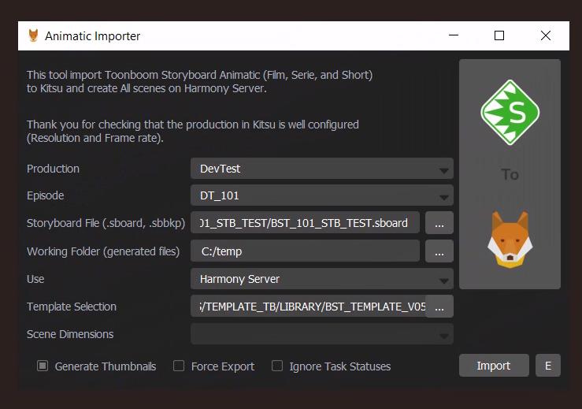
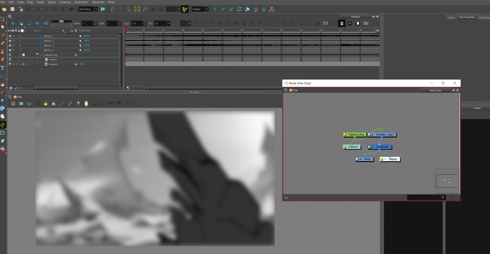

# Mon Expérience chez Ankama 🎨🖼

Bienvenue dans ce repository où je partage quelques détails sur mon expérience chez Ankama en tant que développeur. 
Ce projet présente ce que j'ai réalisé au sein de l'équipe pour améliorer et automatiser le processus de production des scènes d'animation.

## Ce que j'ai fait 🚀

- **Automatisation des Paramétrages dans Toon Boom Harmony** :
  - Développement de scripts JavaScript pour automatiser le **paramétrage de scènes** dans Toon Boom Harmony, permettant de réduire les temps de configuration de plusieurs heures à quelques minutes seulement.
  - Création de solutions pour **l'intégration automatique des décors**, en assurant que chaque image importée soit placée dans les groupes de nodes spécifiques, ajustée à la caméra de scène, et reliée aux composites.
  
  Cela a permis de minimiser les erreurs humaines et d'accélérer le processus de production.

- **Intégration avec le Pipeline de Production (Kitsu)** :
  - Utilisation de **Kitsu** pour gérer les données et suivre la production en temps réel, offrant une visibilité claire sur l'état des projets et permettant de prendre des décisions rapidement.
  - Participation au développement de l'outil 'Animatic Importer', permettant d'importer des animatiques Storyboard Pro vers Kitsu. J'ai ajouté des fonctionnalités telles que **la sélection du logiciel** (Harmony Server, Animate, Harmony Offline), garantissant une flexibilité pour l'équipe de production.
  - Automatisation des **imports d'animatiques** et gestion des scènes, avec une optimisation du workflow qui a permis de réduire les temps de traitement et d'assurer une qualité constante des livrables.

- **Travail en Autonomie** :
  - Réalisation de toutes les tâches de développement de manière autonome, avec des points réguliers avec mon supérieur pour valider l'avancement et les choix techniques.

## Quelques Visuels 📸

  <h3>Animatic Importer</h3>
  
  
  <h3>Scène non automatisée dans Toon Boom Harmony</h3>
  
  
  <h3>Scène automatisée dans Toon Boom Harmony</h3>
  

